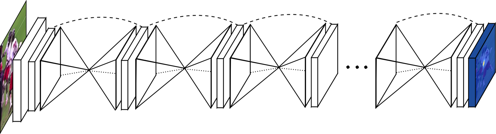
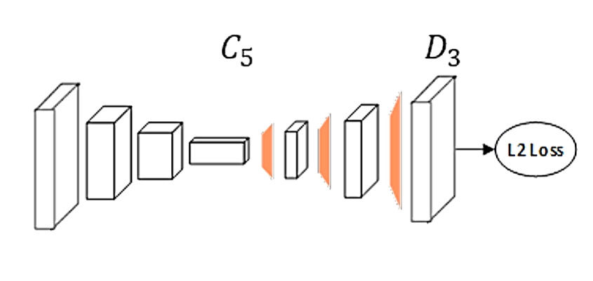
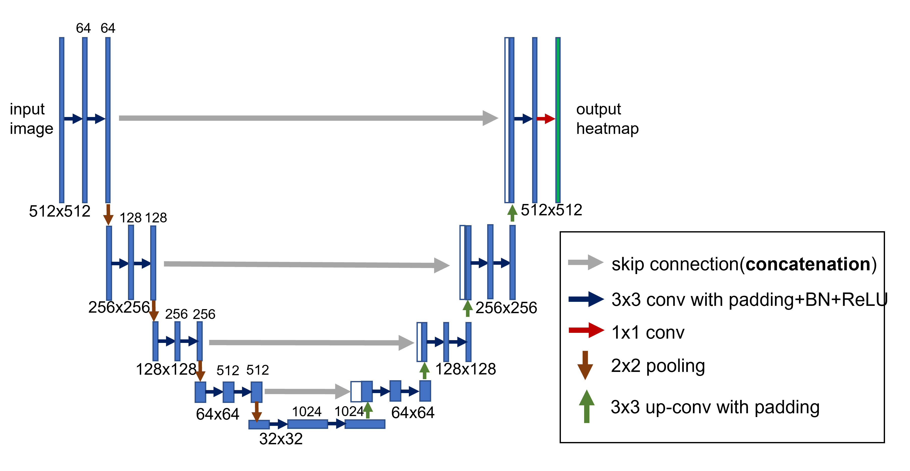
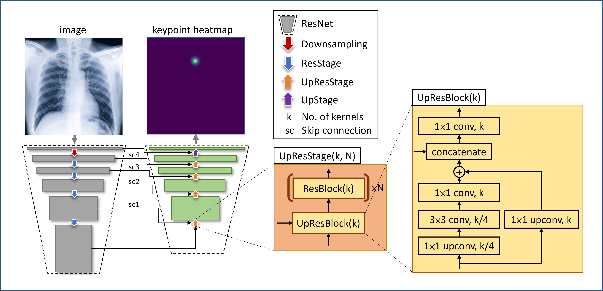

# tf2_pose_estimation

 

It's a framework of Pose Estimation implemented in tensorflow 2.x.

There're Stacked Hourglass Network, Simple Baseline Model, DeepLabV3+, U-Net, ResUNet in this framework.

**Stacked Hourglass Network**: Stacked Hourglass Networks for Human Pose Estimation by Alejandro Newell, Kaiyu Yang, Jia Deng. (https://arxiv.org/abs/1603.06937).


(from https://www.arxiv-vanity.com/papers/1603.06937/)

**Simple Baseline Model**: Simple Baselines for Human Pose Estimation
and Tracking by Bin Xiao, Haiping Wu, and Yichen Wei. (https://arxiv.org/abs/1804.06208)


(from https://arxiv.org/abs/1804.06208)

**DeepLabV3+**: Encoder-Decoder with Atrous Separable Convolution for Semantic Image Segmentation by Liang-Chieh Chen, Yukun Zhu, George Papandreou, Florian Schroff, Hartwig Adam (https://arxiv.org/abs/1802.02611).


(from https://arxiv.org/abs/1802.02611)

**U-Net**: Convolutional Networks for Biomedical Image Segmentation by Olaf Ronneberger, Philipp Fischer, Thomas Brox (https://arxiv.org/abs/1505.04597).



**ResUNet**: A U-net like model with ResNet backbone and UpResBlock.



# Table of Contents

- [tf2\_pose\_estimation](#tf2_pose_estimation)
- [Table of Contents](#table-of-contents)
- [Usage](#usage)
- [API reference](#api-reference)
  - [models](#models)
    - [stack\_hourglass\_net function](#stack_hourglass_net-function)
    - [pose\_resnet function](#pose_resnet-function)
    - [deeplabv3 function](#deeplabv3-function)
    - [unet function](#unet-function)
    - [resunet function](#resunet-function)
  - [losses](#losses)
    - [balanced\_categorical\_crossentropy function](#balanced_categorical_crossentropy-function)
    - [balanced\_binary\_crossentropy function](#balanced_binary_crossentropy-function)
    - [channeled\_categorical\_crossentropy function](#channeled_categorical_crossentropy-function)
  - [metrics](#metrics)
    - [distance\_from\_prob function](#distance_from_prob-function)
  - [utils](#utils)
    - [get\_score\_table function](#get_score_table-function)
    - [read\_img function](#read_img-function)
    - [Keypoint\_reader class](#keypoint_reader-class)
      - [labelme\_json\_to\_dataset method](#labelme_json_to_dataset-method)
      - [labelme\_json\_to\_sequence method](#labelme_json_to_sequence-method)
    - [vis\_img\_ann function](#vis_img_ann-function)
    - [draw\_img\_ann function](#draw_img_ann-function)
    - [get\_class\_weight function](#get_class_weight-function)
    - [decode function](#decode-function)
    - [heatmap2point function](#heatmap2point-function)

# Usage

1. Clone or download
    - Use the command bellow in terminal to git clone:    
    ```git clone https://github.com/samson6460/tf2_pose_estimation.git```

    - Or just download whole files using the **Code > Download ZIP** button in the upper right corner.
    
2. Install dependent packages: 
    ```pip install -r requirements.txt```

3. Copy or move the entire folder **tf2_pose_estimation** next to your main code, and import it direcly:
   ```import tf2_pose_estimation```

# API reference

## models

### stack_hourglass_net function

```
tf2_pose_estimation.models.stack_hourglass_net(
    input_shape=(512, 512, 3),
    num_stacks=8, num_points=15,
    num_filters=256, stage=4,
    activation="sigmoid",
    pretrained_weights=None)
```
Create stacked hourglass network architecture.

**Arguments**

- **input_shape**: A tuple of 3 integers, shape of input image (height, width, channels).
- **num_stacks**: An integer, number of stacks of hourglass network.
- **num_points**: An integer, number of keypoints.
- **num_filters**: An integer, number of convolution filters.
- **stage**: An integer, stage of each hourglass module.
- **activation**: A string or None, activation to add to the top of the network. One of "sigmoid"、"softmax"(per channel) or None.
- **pretrained_weights**: A string, file path of pretrained model.
    
**Return**

A tf.keras Model.

---

###  pose_resnet function

```
tf2_pose_estimation.models.pose_resnet(
    resnet_func=ResNet50,
    input_shape=(512, 512, 3),
    pretrained_backbone="imagenet",
    pretrained_weights=None,
    num_layers=3,
    num_filters=256,
    kernel_size=4,
    num_points=15,
    activation='sigmoid')
```
Create Simple Baseline Model architecture.
    
**Arguments**

- **resnet_func**: A Resnet from tensorflow.keras.applications. e.g., tensorflow.keras.applications.ResNet50.
- **input_shape**: A tuple of 3 integers, shape of input image.
- **pretrained_backbone**: one of None (random initialization), 'imagenet' (pre-training on ImageNet), or the path to the weights file to be loaded.
- **pretrained_weights**: A string, file path of pretrained model.
- **num_layers**: An integer, number of transpose convolution layers. This arg will effect the output shape.
- **num_filters**: An integer, number of filters of each transpose convolution.
- **kernel_size**: An integer, kernel size of each transpose convolution.
- **num_points**: An integer, number of keypoints.
- **activation**: A string or None, activation to add to the top of the network. One of "sigmoid"、"softmax"(per channel) or None.

**Return**

A tf.keras Model.

---

### deeplabv3 function
```
tf2_pose_estimation.models.deeplabv3(
    pretrained_weights='pascal_voc',
    input_tensor=None,
    input_shape=(512, 512, 3),
    num_points=15,
    backbone='xception',
    OS=16, alpha=1.,
    activation="softmax")
```
Instantiates the Deeplabv3+ architecture.

Optionally loads weights pre-trained on PASCAL VOC or Cityscapes.
This model is available for TensorFlow only.

**Arguments**

- **pretrained_weights**: one of 'pascal_voc' (pre-trained on pascal voc), 'cityscapes' (pre-trained on cityscape) or local file path of pretrained model or None (random initialization).
- **input_tensor**: optional Keras tensor (i.e. output of `layers.Input()`) to use as image input for the model.
- **input_shape**: shape of input image. format HxWxC PASCAL VOC model was trained on (512, 512, 3) images.
    None is allowed as shape/width.
- **classes**: number of desired classes (will be deprecated).
    PASCAL VOC has 21 classes, Cityscapes has 19 classes.
    If number of classes not aligned with the weights used,
    last layer is initialized randomly.
- **num_points**: An integer, number of keypoints.
- **backbone**: backbone to use. one of {'xception','mobilenetv2'}
- **OS**: determines input_shape/feature_extractor_output ratio.
    One of {8,16}.
    Used only for xception backbone.
- **alpha**: controls the width of the MobileNetV2 network.
    This is known as the width multiplier in the MobileNetV2 paper.
  - If `alpha` < 1.0, proportionally decreases the number of filters in each layer.
  - If `alpha` > 1.0, proportionally increases the number of filters in each layer.
  - If `alpha` = 1, default number of filters from the paper are used at each layer.
    Used only for mobilenetv2 backbone.
    Pretrained is only available for alpha=1.
- **activation**: A string or None, activation to add to the top of the network. One of "sigmoid"、"softmax"(per channel) or None.

**Return**

A tf.keras model instance.

**Raises**

- **RuntimeError**: If attempting to run this model with a backend that does not support separable convolutions.
- **ValueError**: in case of invalid argument for `backbone`.

---

### unet function
```
tf2_pose_estimation.models.unet(
    pretrained_weights=None,
    input_shape=(512, 512, 3),
    conv_activation='relu',
    num_points=15,
    activation='sigmoid')
```
Create U-Net architecture.
    
**Arguments**

- **pretrained_weights**: A string, file path of pretrained model.
- **input_shape**: A tuple of 3 integers, shape of input image.
- **conv_activation**: A string, activation function for convolutional layer.
- **num_points**: An integer, number of keypoints.
- **activation**: A string or None, activation to add to the top of the network. One of "sigmoid"、"softmax"(per channel) or None.

**Return**

A tf.keras Model.

---

### resunet function

```
tf2_pose_estimation.models.resunet(
    resnet_func=ResNet101,
    input_shape=(512, 512, 3),
    pretrained_backbone="imagenet",
    pretrained_weights=None,
    upskip_id=[-33, 80, 38, 4],
    res_num_blocks=[2, 22, 3, 2],
    skip_connect_input=True,
    num_points=15,
    activation='sigmoid')
```
Create ResU-Net network architecture.

**Arguments**
- **resnet_func**: A Resnet from tensorflow.keras.applications.
    e.g., tensorflow.keras.applications.ResNet152.
- **input_shape**: A tuple of 3 integers,
    shape of input image.
- **pretrained_backbone**: one of None (random initialization), 'imagenet' (pre-training on ImageNet), or the path to the weights file to be loaded.
- **pretrained_weights**: A string, 
    file path of pretrained model.
- **upskip_id**: A list of integer,
    index of skip connections from extracting path.
- **res_num_blocks**: A list of integer.
    number of repetitions of up-residual blocks.
- **skip_connect_input**: A boolean, whether to skip connect to input tensor.
- **num_points**: An integer, number of keypoints.
- **activation**: A string or None, activation to add to the top of the network. One of "sigmoid"、"softmax"(per channel) or None.

**Return**

A tf.keras Model.

------

## losses

### balanced_categorical_crossentropy function

```
tf2_pose_estimation.losses.balanced_categorical_crossentropy(class_weight=1)
```

**Arguments**

- **class_weight**: Optional `class_weight` acts as reduction weighting coefficient for the per-class losses. If a scalar is provided, then the loss is simply scaled by the given value.

**Return**

A tf2 loss function.

---

### balanced_binary_crossentropy function

```
tf2_pose_estimation.losses.balanced_binary_crossentropy(class_weight=1, binary_weight=1)
```

**Arguments**

- **class_weight**: Optional `class_weight` acts as reduction weighting coefficient for the per-class losses. If a scalar is provided, then the loss is simply scaled by the given value.
- **binary_weight**: Optional `binary_weight` acts as reduction weighting coefficient for the positive and negative losses.

**Return**

A tf2 loss function.

---

### channeled_categorical_crossentropy function

```
tf2_pose_estimation.losses.channeled_categorical_crossentropy(y_true, y_pred)
```

Calculate crossentropy and sum each channel(keypoint heatmap).

**Return**

A loss tensor with shape: (N, keypoints).

------

## metrics

### distance_from_prob function

```
tf2_pose_estimation.metrics.distance_from_prob(y_true, y_pred)
```

Get keypoint distance from heatmap probability.

**Return**

A distance value.

------

## utils

### get_score_table function

```
tf2_pose_estimation.utils.get_score_table(
    ground_truth, prediction,
    decode_method="max",
    class_names=["Head", "Eye_L", "Eye_R", "Nose",
                 "Upper_Lip", "Lower_Lip", "Shoulder_R","Shoulder_L",
                 "Elbow_R", "Elbow_L", "Wrist_R", "Wrist_L",
                 "MP_joint_R", "MP_joint_L", "Hip_R", "Hip_L",
                 "Knee_R", "Knee_L", "Ankle_R", "Ankle_L",
                 "MTP_joint_R", "MTP_joint_L"],
    dist_thresh=None,
    oks_thresh=0.5,
    norm_index=[[6, 7], [0, [14, 15]]],
    index=None)
```

Get mOKS(Object Keypoint Similarity) and PCK(Percentage of Correct Keypoints) table.

**Arguments**

- **ground_truth**: A ndarray, shape should be: (None, heights, widths, num_classes).
- **prediction**: A ndarray, shape should be: (None, heights, widths, num_classes) or (1, heights, widths, num_classes). If batch size is 1, `index` is necessary.
- **decode_method**: One of "max" and "mean".
    - "max": Use the brightest position of the heatmap as the keypoint.
    - "mean": Use the average brightness of the heatmap as the keypoint.
- **class_names**: A list of string, corresponding name of label.
- **dist_thresh**: None or a float, threshold of normalized distance for 0.5 OKS.
If dist_thresh set as None, it'll be set as 2.35*std (from `ground_truth`).
If dist_thresh set as None and batch size of ground_truth is 1, it'll be set as 0.1.
- **oks_thresh**: A float, threshold of OKS for recall.
- **norm_index**: A 2D array like.
- **index**: An integer, Calculate OKS of a single index.

**Return**

A pandas.Dataframe.

---

### read_img function

```
tf2_pose_estimation.utils.read_img(
    path, size=(512, 512), rescale=None, preprocessing=None)
```

Read images as ndarray.

**Arguments**

- **path**: A string, path of images.
- **size**: A tuple of 2 integers, (height, width).
- **rescale**: A float or None, specifying how the image value should be scaled. If None, no scaled.
- **preprocessing**: A function of data preprocessing.(e.g. noralization, shape manipulation, etc.)

**Return**

A batch of image arrays.

---

### Keypoint_reader class

```
tf2_pose_estimation.utils.Keypoint_reader()
```

Reader for the images and keypoint annotations.

**Arguments**

- **rescale**: A float or None, specifying how the image value should be scaled. If None, no scaled.
- **preprocessing**: A function of data preprocessing.(e.g. noralization, shape manipulation, etc.)
- **augmenter**: A `imgaug.augmenters.meta.Sequential` instance.
- **aug_times**: An integer, the default is 1, which means no augmentation.

**Attributes**

- **rescale**
- **preprocessing**
- **augmenter**
- **file_names**: A list of string with all file names that have been read.

**Return**

A reader instance for images and annotations.

#### labelme_json_to_dataset method

```
Keypoint_reader.labelme_json_to_dataset(
    self, img_path=None, label_path=None,
    class_names=["Head", "Eye_L", "Eye_R", "Nose",
                 "Upper_Lip", "Lower_Lip", "Shoulder_R", "Shoulder_L",
                 "Elbow_R", "Elbow_L", "Wrist_R", "Wrist_L",
                 "MP_joint_R", "MP_joint_L", "Hip_R", "Hip_L",
                 "Knee_R", "Knee_L", "Ankle_R", "Ankle_L",
                 "MTP_joint_R", "MTP_joint_L"],
    img_size=(448, 448), label_size="auto",
    heatmap_type="gs", sigma=3.14, normalize=False,
    num_stacks=1, shuffle=False, seed=None,
    encoding="big5", thread_num=10)
```

Convert the JSON file generated by `labelme` into array.

**Arguments**

- **img_path**: A string, file path of images.
- **label_path**: A string, file path of annotations.
- **class_names**: A list of string, containing all label names.
- **img_size**: A tuple of 2 integer, shape of output image(height, width).
- **label_size**: A tuple of 2 integers or a string.
    - "auto" means to set size as img_size divided by 4.
    - "same" means to set size as img_size.
- **heatmap_type**: A string, one of "gs" or "exp".
    - "gs": Gaussian heatmap.
    - "exp": Exponential heatmap(proposed by https://pubmed.ncbi.nlm.nih.gov/31683913/).
- **sigma**: An integer or list of integers, standard deviation of 2D gaussian distribution.
- **normalize**: A boolean, whether to normalize each channel in heatmaps so that sum would be 1.
- **num_stacks**: An integer, number of stacks for hourglass network.
- **shuffle**: Boolean, default: True.
- **seed**: An integer, random seed, default: None.
- **encoding**: A string, encoding format of file, default: "big5".
- **thread_num**: An integer, specifying the number of threads to read files.

**Return**

A tuple of 2 ndarrays, (img data, label data), a list of tuples like above if num_stacks > 1.
- img data: 
    shape: (samples, image height, image width, channels)
- label data:
    shape: (samples, heatmap height, heatmap width, class number)

#### labelme_json_to_sequence method

```
Keypoint_reader.labelme_json_to_sequence(
    self, img_path=None, label_path=None,
    batch_size=20,
    class_names=["Head", "Eye_L", "Eye_R", "Nose",
                 "Upper_Lip", "Lower_Lip", "Shoulder_R", "Shoulder_L",
                 "Elbow_R", "Elbow_L", "Wrist_R", "Wrist_L",
                 "MP_joint_R", "MP_joint_L", "Hip_R", "Hip_L",
                 "Knee_R", "Knee_L", "Ankle_R", "Ankle_L",
                 "MTP_joint_R", "MTP_joint_L"],
    img_size=(448, 448), label_size="auto",
    heatmap_type="gs", sigma=2,
    normalize=False, num_stacks=1,
    shuffle=False, seed=None,
    encoding="big5", thread_num=1)
```

Convert the JSON file generated by `labelme` into a Sequence.

**Arguments**

- **img_path**: A string, file path of images.
- **label_path**: A string, file path of annotations.
- **batch_size**:  An integer, size of the batches of data (default: 20).
- **class_names**: A list of string, containing all label names.
- **img_size**: A tuple of 2 integer, shape of output image(heights, widths).
- **label_size**: A tuple of 2 integers or a string.
    - "auto" means to set size as img_size divided by 4.
    - "same" means to set size as img_size.
- **heatmap_type**: A string, one of "gs" or "exp".
    - "gs": Gaussian heatmap.
    - "exp": Exponential heatmap(proposed by https://pubmed.ncbi.nlm.nih.gov/31683913/).
- **sigma**: An integer or list of integers, standard deviation of 2D gaussian distribution.
- **normalize**: A boolean, whether to normalize each channel in heatmaps so that sum would be 1.
- **num_stacks**: An integer, number of stacks of hourglass network.
- **shuffle**: Boolean, default: True. 
- **seed**: An integer, random seed, default: None.
- **encoding**: A string, encoding format of file, default: "big5".
- **thread_num**: An integer, specifying the number of threads to read files.

**Return**

A tf.Sequence.

Sequence[i]: A tuple of 2 ndarrays, (img data, label data), a list of tuples like above if num_stacks > 1.

- img data: 
    shape: (batches, image height, image width, channels)
- label data:
    shape: (batches, heatmap height, heatmap width, class number)

---


### vis_img_ann function

```
tf2_pose_estimation.utils.vis_img_ann(
    img, label,
    decode_method="max",
    color=['r', 'lime', 'b', 'c', 'm', 'y',
           'pink', 'w', 'brown', 'g', 'teal',
           'navy', 'violet', 'linen', 'gold'],
    connections = None,
    figsize=None,
    dpi=None,
    axis="off",
    savefig_path=None,
    return_fig_ax=False,
    fig_ax=None,
    point_radius=5,
    linewidth=2,
    line_alpha=0.6)
```

Visualize image with its annotation by Matplotlib.

**Arguments**

- **img**: A ndarry of shape(image height, image width, color channels).
        label: A ndarray of annotations.
- **decode_method**: One of "max" and "mean".
    - "max": Use the brightest position of the heatmap as the keypoint.
    - "mean": Use the average brightness of the heatmap as the keypoint.
- **color**: A list of color string or RGB tuple of float.
    - Example of color string: `['r', 'lime', 'b', 'c', 'm', 'y', 'pink', 'w', 'brown', 'g', 'teal', 'navy', 'violet', 'linen', 'gold']`(Default).
        Check for more info about color string by the following url: https://matplotlib.org/tutorials/colors/colors.html
    - Example of RGB tuple of float: `[(1, 0, 0), (0, 0, 1)]`(which means Red、Blue).
- **connections**: None or a list of lists of integers. The way of key point connection. For example, `[[0, 2], [1, 3]]` means connecting point 0 and point 2, and connecting point 1 and point 3.
- **figsize**: (float, float), optional, width, height in inches. If not provided, defaults to [6.4, 4.8].        
- **dpi**: float, default: rcParams["figure.dpi"] (default: 100.0) The resolution of the figure in dots-per-inch. Set as 1.325, then 1 inch will be 1 dot.    
- **axis**: bool or str
    If a bool, turns axis lines and labels on or off.
    If a string, possible values are: https://matplotlib.org/3.1.1/api/_as_gen/matplotlib.axes.Axes.axis.html
- **savefig_path**: None or string or PathLike or file-like object. A path, or a Python file-like object.
- **return_fig_ax**: A boolean.
- **fig_ax**: (matplotlib.pyplot.figure, matplotlib.pyplot.axes), reusing figure and axes can save RAM.
- **point_radius**: 5.
- **linewidth**: 2.
- **line_alpha**: 0.6.

---

### draw_img_ann function

```
tf2_pose_estimation.utils.draw_img_ann(
    img, label,
    decode_method="max",
    color=['r', 'lime', 'b', 'c', 'm', 'y',
           'pink', 'w', 'brown', 'g', 'teal',
           'navy', 'violet', 'linen', 'gold'],
    connections = None,
    point_radius=8,
    linewidth=4)
```

Draw annotation on image by OpenCV.

**Arguments**

- **img**: A ndarry of shape: (image height, image width, color channels). dtype: uint8, range: [0-255].
- **label**: A ndarray of annotations.
- **decode_method**: One of "max" and "mean".
    - "max": Use the brightest position of the heatmap as the keypoint.
    - "mean": Use the average brightness of the heatmap as the keypoint.
- **color**: A list of color string or RGB tuple of float.
    - Example of color string: `['r', 'lime', 'b', 'c', 'm', 'y', 'pink', 'w', 'brown', 'g', 'teal', 'navy', 'violet', 'linen', 'gold']`(Default).
        Check for more info about color string by the following url: https://matplotlib.org/tutorials/colors/colors.html
    - Example of RGB tuple of float: `[(1, 0, 0), (0, 0, 1)]`(which means Red、Blue).
- **connections**: None or a list of lists of integers. The way of key point connection. For example, `[[0, 2], [1, 3]]` means connecting point 0 and point 2, and connecting point 1 and point 3.
- **point_radius**: 5.
- **linewidth**: 2.

**Return**

An image array with its annotation.

---

### get_class_weight function

```
tf2_pose_estimation.utils.get_class_weight(label_data, method="alpha")
```
Get the weight of the category.

**Arguments**

- **label_data**: A ndarray of shape (batch_size, grid_num, grid_num, info).
- **method**: A string, one of "alpha"、"log"、"effective"、"binary".

**Return**

A list containing the weight of each category.

---

### decode function

```
tf2_pose_estimation.utils.decode(
    label,
    zoom_r,
    method="mean")
```

Decode one heatmap to points.

**Arguments**

- **label**: An array, shape: (heatmap height, heatmap width, num_points).
- **zoom_r**: An array like of magnification, (height ratio, width ratio).
- **method**: One of "max" and "mean".
    - "max": Use the brightest position of the heatmap as the keypoint.
    - "mean": Use the average brightness of the heatmap as the keypoint.

**Returns**

(x_array, y_array).
- x_array: 1D array with x axis.
- y_array: 1D array with y axis.

---

### heatmap2point function

```
def heatmap2point(
    heatmaps,
    zoom_r=(1, 1),
    method="max")
```

Convert multiple heatmaps to points.

**Arguments**

- **heatmap**: An array, shape: (batches, heights, widths, num_points).
- **zoom_r**: An array like of magnification, (heights, widths).
- **method**: One of "max" and "mean".
    - "max": Use the brightest position of the heatmap as the keypoint.
    - "mean": Use the average brightness of the heatmap as the keypoint.

**Return**

An array, shape: (batches, num_points, 2).
